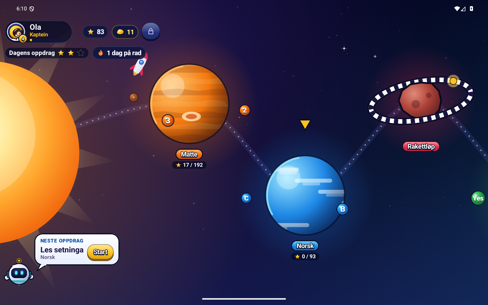
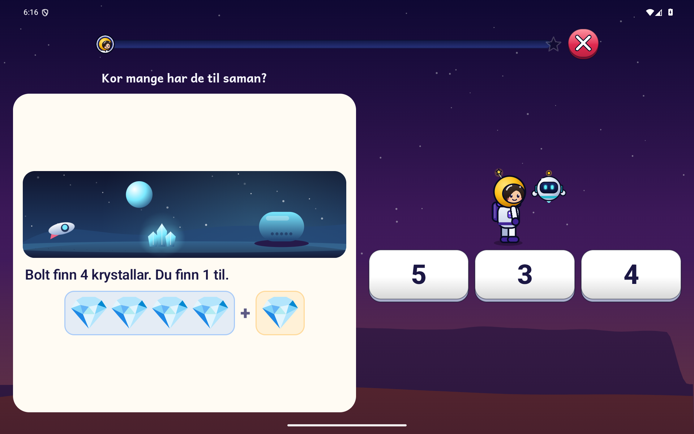
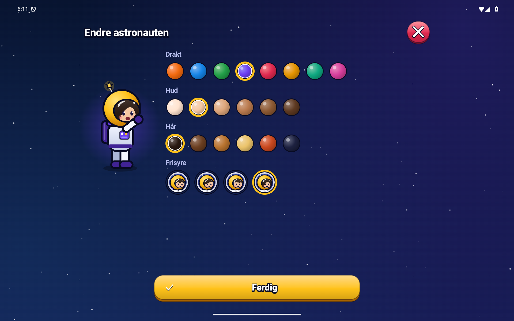
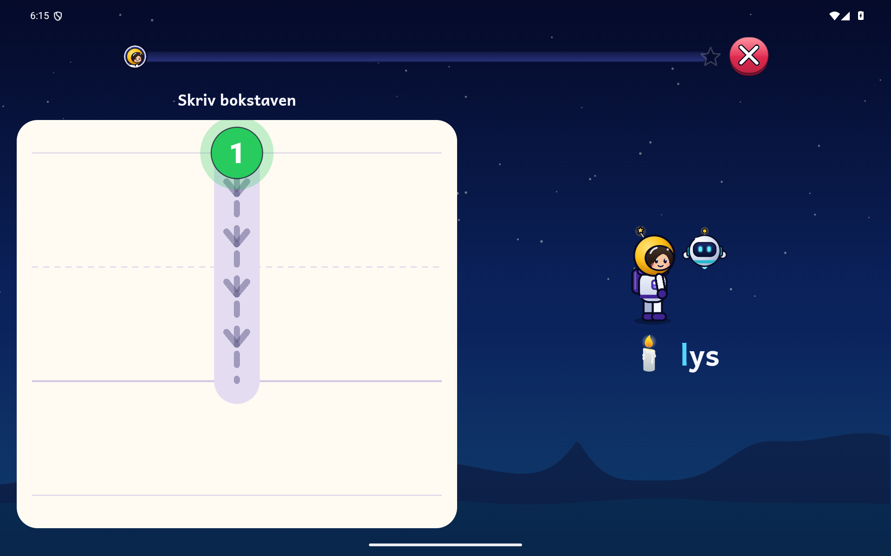
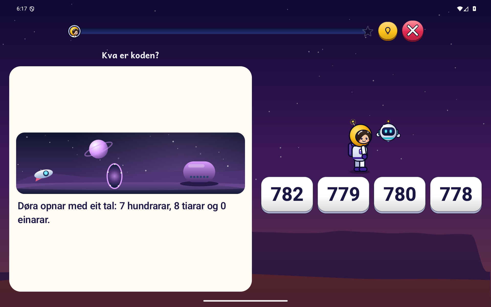

<p align="center"></p>

<p align="center"><strong>Matte, norsk, engelsk og verdsrommet for barn frå 5 til 9 år.</strong><br />Android 8.0 eller nyare · mobil og nettbrett · nynorsk og bokmål</p>

<p align="center"><a href="https://github.com/oyvhov/komet-android/releases/download/v2.0.0/Komet-v2.0.0.apk"><strong>⬇ LAST NED KOMET 2.0.0 — APK</strong></a><br /><a href="https://github.com/oyvhov/komet-android/releases/latest">Nyaste release</a> · <a href="docs/INNHALD.md">Sjå alle nivåa</a></p>

## Eit romeventyr å lære i

Lag din eigen astronaut og reis med roboten Bolt. Utforsk planetane, løys oppgåver og saml
stjerner og romkort. **128 nivå i fire fag** gir både enkle første steg og meir å bryne seg på.
Mange nivå lagar nye tal og kombinasjonar kvar runde, så barnet kan øve fleire gonger.



## Kva kan barnet gjere?

| Fag | Døme på oppgåver |
| --- | --- |
| **Matte** | Telje, pluss og minus, klokke, pengar, gonge og dele, mønster og romoppdrag. |
| **Norsk** | Lytte etter lydar, finne rim, byggje ord, lese setningar og skrive bokstavar med fingeren. |
| **Engelsk** | Lytte til ord og fraser, kjenne att fargar og dyr og stave engelske ord. |
| **Verdsrommet** | Utforske sola, månen, planetane, romfart og stjernehimmelen. |

### Nytt i 2.0: hjelp Bolt og send romskipet

Tolv romoppdrag tek barnet frå krystallar og tiarvenner til forsyningar og hemmelege talkodar.
Etter oppgåva sender barnet hjelpa til basen. Romskipet flyg med lyshale og landingsglitter,
og lysa i basen viser framgangen i runden. Ulike oppdrag har eigne landskap og landemerke.



### Ein astronaut som er din

Vel drakt, hud, hår og frisyre. Tente gullklumpar kan brukast til pynt til astronauten, Bolt og
raketten. **Gullklumpar er berre spelepengar. Ingen ekte pengar eller kjøp i appen.**



<details>
<summary>Fleire bilete: skriving og kodeportal</summary>





</details>

## Tilpassa barnet

- **Nynorsk og bokmål**, STORE eller små bokstavar og fleire profilar på same eining.
- Vel klassesteg som startpunkt. Anbefalte oppgåver tek omsyn til dette, og **Utforsk** gir fri tilgang til oppgåvetypane.
- Dei enklaste romoppdraga har bilete frå start, tre svaralternativ og fem oppgåver i runden.
- Hjelp og «Prøv igjen». Etter to feil blir rett svar vist; romoppdraga forklarer også rette svar.
- Vanlege rundar har **ingen tidsfrist eller liv å miste**. Det separate rakettløpet varer i 60 sekund.
- Framgang blir lagra undervegs. Repetisjon hjelper barnet å øve på det som er vanskeleg.
- Foreldresida viser framgang og innstillingar bak eit gongestykke.

## Installer på Android

1. Trykk **[Last ned APK](https://github.com/oyvhov/komet-android/releases/download/v2.0.0/Komet-v2.0.0.apk)** på telefonen eller nettbrettet.
2. Opne fila **Komet-v2.0.0.apk**. Dersom Android spør, tillat installasjon frå nettlesaren du brukte.
3. Vel **Installer**, opne Komet og lag ein profil.

Har du Komet frå før? Installer oppå den eksisterande appen. **Ikkje avinstaller først** – då
kan lokal framgang bli sletta. Vanleg oppdatering beheld profilar og stjerner.

## Auto update – slik fungerer det

**Komet sjekkar sjølv etter nye versjonar** når appen blir opna eller kjem fram att, høgst éin
gong per tolv timar. Ein vaksen vel når oppdateringa skal lastast ned og installerast.

**Foreldre → Innstillingar → Appoppdateringar → Sjekk no**

Vel **Last ned oppdatering**, og deretter **Installer oppdatering**. Android kan be om løyve til
å installere frå Komet. Appen kontrollerer fila, versjonen og signaturen før installasjonen.
Automatisk sjekk kan slåast av. Du treng ikkje slå på testutgåver for å få 2.0.0.

## Utan reklame og konto

Læringsinnhaldet fungerer utan nett. Ingen reklame, sporing eller konto. Framgang blir lagra på
eininga. Oppdateringssjekk og nedlasting bruker GitHub og krev nett.

Opplesing bruker talemotoren på eininga. Norsk og engelsk stemme må vere installert for full
opplesing; dette kan krevje ei eingongsnedlasting i Android sine tekst-til-tale-innstillingar.

## Om denne utgåva

2.0.0 er testa med automatiske testar og på Android-emulator i mobil- og nettbrettformat,
også med stor skrift. Testing på fysisk nettbrett står att.

[Meld ein feil](https://github.com/oyvhov/komet-android/issues) · [Endringslogg](CHANGELOG.md) · [Alle nivå](docs/INNHALD.md)

<details>
<summary>For utviklarar</summary>

Kotlin og Jetpack Compose. Les [arbeidsrettleiinga](docs/AI_INSTRUCTIONS.md),
[vegkartet](ROADMAP.md) og [releaseoppskrifta](docs/RELEASE_WORKFLOW.md).

```powershell
powershell -NoProfile -ExecutionPolicy Bypass -File C:\LeseApp\scripts\Build-Komet.ps1 -Release
```

Andika: SIL International, SIL Open Font License 1.1. Logoen byggjer på appen sitt eige kometikon.
Skjermbileta er frå emulator med ein testprofil og inneheld ikkje ekte persondata.

</details>
