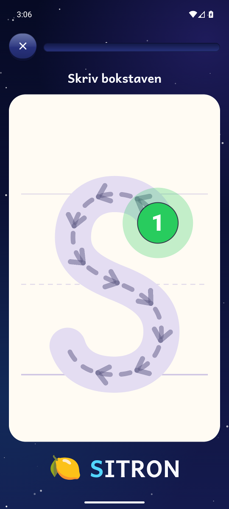
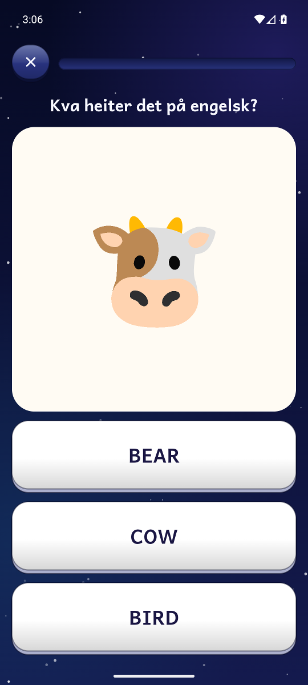
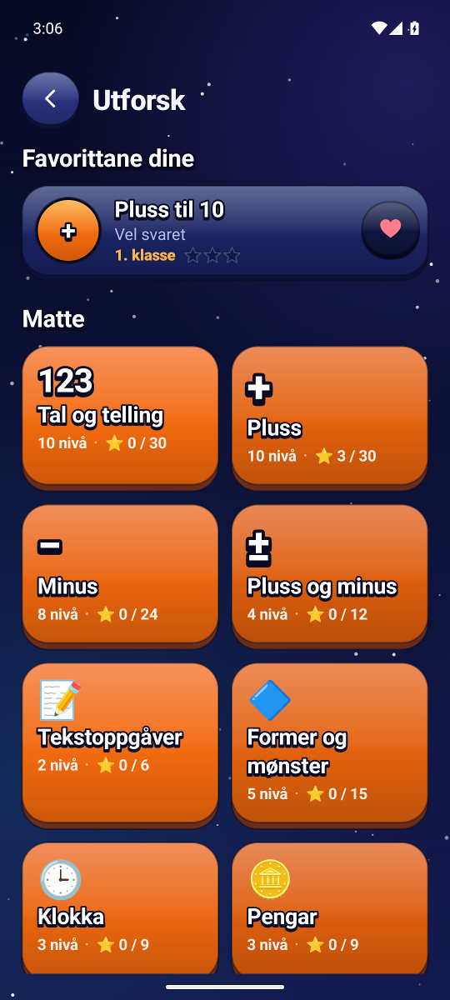
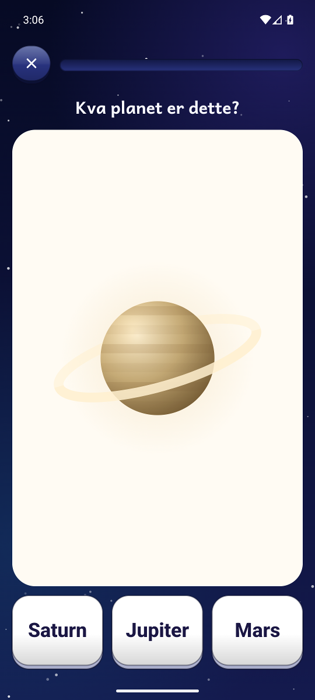

<h1 align="center">Komet</h1>
<p align="center">Matte, norsk, engelsk og verdsrommet – for barn frå 5 til 9 år.</p>
<p align="center">Android 8.0 eller nyare · telefon og nettbrett · nynorsk og bokmål</p>
<p align="center">
  <a href="https://github.com/oyvhov/komet-android/releases/latest"><strong>Last ned APK</strong></a>
  &nbsp; · &nbsp;
  <a href="docs/INNHALD.md">Alle nivåa</a>
  &nbsp; · &nbsp;
  <a href="https://github.com/oyvhov/komet-android/issues">Meld ein feil</a>
</p>

<p align="center">
  
  
  
  
</p>

Komet gjer øving til ei romferd. Barnet samlar stjerner, låser opp planetar, stig i rang frå
Romkadett til Stjernemeister og samlar romkort med fakta om solsystemet. Under panseret er det
116 nivå i fire fag som lagar nye oppgåver kvar gong.

## Kva barnet får

- **Matte:** telling, skrive tal, tiarvenner, pluss og minus til 100, dobling, tekstoppgåver, vekta,
  former og mønster, klokka, norske pengar og gongetabellen – med tiarrammer, tiarstavar og bilete som hjelp.
- **Norsk:** bokstavar i den rekkjefølgja 1. klasse vanlegvis møter dei, skrive bokstavar med fingeren,
  første og siste lyd, stavingar, rim, byggje ord, småord, setningar og korte tekstar.
- **Engelsk:** fraser, fargar, tal, dyr, mat, kropp, familie, klede og staving, lesne høgt med engelsk stemme.
- **Verdsrommet:** sola, månen, planetane, romfart og stjernehimmelen.
- **Skriv med kometen:** spor bokstavar og tal i rett strekrekkjefølgje, med startprikk og piler.
- **Utforsk og favorittar:** finn oppgåvetypane barnet likar – pluss, klokka, rim, planetar – på tvers av
  trinn, og legg dei til med eit hjarte.
- **Repetisjon:** ein eigen runde med det barnet oftast bommar på.
- **Rakettløp:** 60 sekund hovudrekning med personleg rekord.
- **Opplesing og barneskrift:** oppgåvene blir lesne høgt, og teksten bruker Andika med «a» og «g» slik
  skulen lærer dei.
- **Snill feilhandtering:** «Prøv igjen», hjelp-pære med bilete, og rett svar med forklaring etter to forsøk.
  Kvart svar blir lagra, så ein avbroten runde kan haldast fram.

<p align="center">
  
  
</p>

## Kva foreldra får

- Framgang siste 7 dagar, prosent rett første gong og kva barnet bør øve meir på.
- Målform (nynorsk/bokmål), STORE eller små bokstavar, klassesteg og dagleg mål per barn.
- Fleire profilar på same eining.
- Foreldresida er låst med eit gongestykke.
- Oppdatering i appen: ein gul prikk på låsen viser at ein ny versjon er klar.

## Kom i gang

1. Last ned APK-en frå [Releases](https://github.com/oyvhov/komet-android/releases) og opne han på
   telefonen eller nettbrettet.
2. Tillat installasjon frå kjelda Android spør om.
3. Opne Komet og følg oppsettet: målform, namn, figur, klassesteg og bokstavar.

Nye versjonar kjem deretter gjennom **Foreldre → Innstillingar → Appoppdateringar**. Komet
kontrollerer storleik, SHA-256 og signatur før Android spør om å installere. Framgang og profilar
blir verande. Komet 1.0.0 hadde ikkje denne funksjonen og må erstattast manuelt éin gong.

Opplesinga brukar talemotoren på eininga. Står det «Manglar norsk stemme» eller «Engelsk stemme
manglar» på foreldresida, installer språket i Google sin talemotor (Innstillingar → System → Språk →
Tekst til tale).

## Personvern

Ingen reklame, ingen kjøp i appen, ingen konto og ingen sporing. Framgang blir lagra berre på
eininga. Den einaste nettkontakten er når Komet spør GitHub om det finst ein ny versjon – då får
GitHub IP-adressa og Komet-versjonen. Sjekken kan slåast av på foreldresida.

## Utvikling

Kotlin og Jetpack Compose med same verktøy som [Spole](https://github.com/oyvhov/spole-android)
(AGP 9.2.1, Kotlin 2.3.10, Compose BOM 2026.06.00). Les [AGENTS.md](AGENTS.md),
[AI-instruksane](docs/AI_INSTRUCTIONS.md), [vegkartet](ROADMAP.md) og
[release-flyten](docs/RELEASE_WORKFLOW.md) før endringar.

```powershell
powershell -NoProfile -ExecutionPolicy Bypass -File C:\LeseApp\scripts\Build-Komet.ps1 -Release
```

Skrifta Andika er laga av SIL International og er fri under SIL Open Font License 1.1
(`app/src/main/assets/licenses/andika-ofl.txt`).

*Skjermbileta er tekne i emulator med ein testprofil og inneheld ingen persondata.*
