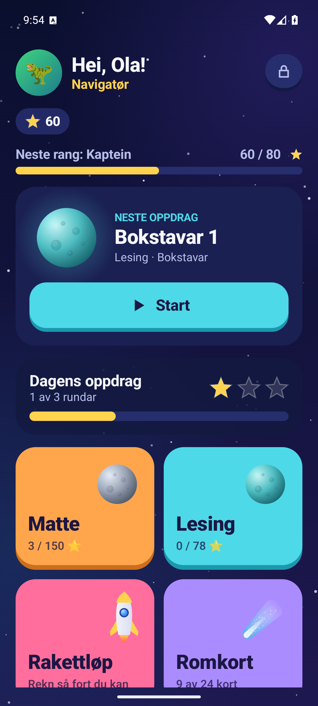
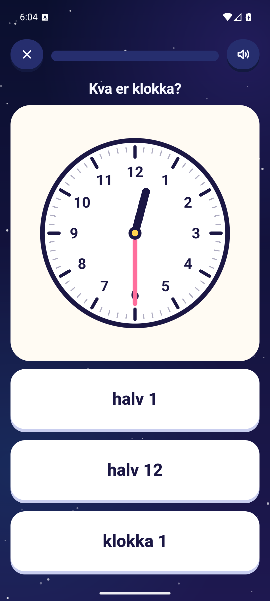
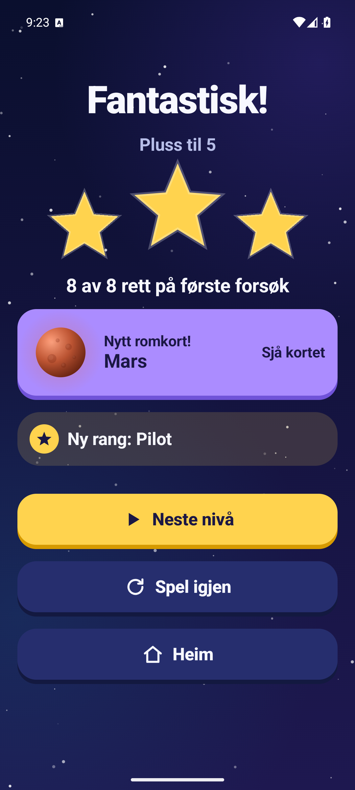
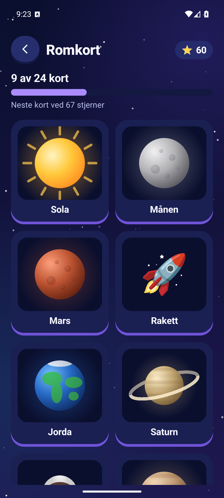
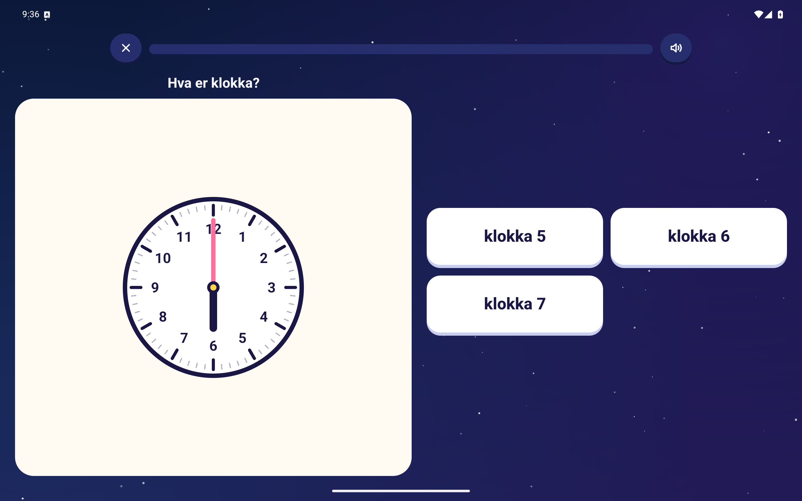

<h1 align="center">Komet</h1>
<p align="center">Rekning og lesing i verdsrommet – for barn frå 5 til 9 år.</p>
<p align="center">Android 8.0 eller nyare · telefon og nettbrett · nynorsk og bokmål</p>
<p align="center">
  <a href="https://github.com/oyvhov/komet-android/releases/latest"><strong>Last ned APK</strong></a>
  &nbsp; · &nbsp;
  <a href="docs/INNHALD.md">Alle nivåa</a>
  &nbsp; · &nbsp;
  <a href="https://github.com/oyvhov/komet-android/issues">Meld ein feil</a>
</p>

<p align="center">
  
  
  
  
</p>

Komet gjer øving til ei romferd. Barnet samlar stjerner, låser opp planetar, stig i rang frå
Romkadett til Stjernemeister og samlar romkort med fakta om solsystemet. Under panseret er det
76 nivå i matte og lesing som lagar nye oppgåver kvar gong.

## Kva barnet får

- **Matte:** telling, tiarvenner, pluss og minus til 100, dobling, tekstoppgåver, vekta, former og
  mønster, klokka, norske pengar og gongetabellen – med tiarrammer, tiarstavar og bilete som hjelp.
- **Lesing:** bokstavar i den rekkjefølgja 1. klasse vanlegvis møter dei, første og siste lyd,
  stavingar, rim, byggje ord, småord, samansette ord, setningar, sant/usant og korte tekstar.
- **Rakettløp:** 60 sekund hovudrekning med personleg rekord.
- **Opplesing:** oppgåvene blir lesne høgt med norsk stemme, så appen kan brukast før barnet les.
- **Snill feilhandtering:** «Prøv igjen», hjelp-pære med bilete, og rett svar med forklaring etter to forsøk.

<p align="center">
  
</p>

## Kva foreldra får

- Framgang siste 7 dagar, prosent rett første gong og kva barnet bør øve meir på.
- Målform (nynorsk/bokmål), STORE eller små bokstavar, klassesteg og dagleg mål per barn.
- Fleire profilar på same eining.
- Foreldresida er låst med eit gongestykke.
- Oppdatering i appen: ein gul prikk på låsen viser at ein ny versjon er klar.

## Kom i gang

1. Last ned APK-en frå [Releases](https://github.com/oyvhov/komet-android/releases) og opne han på
   telefonen eller nettbrettet.
2. Tillat installasjon frå kjelda Android spør om.
3. Opne Komet og følg oppsettet: målform, namn, figur, klassesteg og bokstavar.

Nye versjonar kjem deretter gjennom **Foreldre → Innstillingar → Appoppdateringar**. Komet
kontrollerer storleik, SHA-256 og signatur før Android spør om å installere. Framgang og profilar
blir verande. Komet 1.0.0 hadde ikkje denne funksjonen og må erstattast manuelt éin gong.

Opplesinga brukar talemotoren på eininga. Står det «Manglar norsk stemme» på foreldresida,
installer norsk i Google sin talemotor (Innstillingar → System → Språk → Tekst til tale).

## Personvern

Ingen reklame, ingen kjøp i appen, ingen konto og ingen sporing. Framgang blir lagra berre på
eininga. Den einaste nettkontakten er når Komet spør GitHub om det finst ein ny versjon – då får
GitHub IP-adressa og Komet-versjonen. Sjekken kan slåast av på foreldresida.

## Utvikling

Kotlin og Jetpack Compose med same verktøy som [Spole](https://github.com/oyvhov/spole-android)
(AGP 9.2.1, Kotlin 2.3.10, Compose BOM 2026.06.00). Les [AGENTS.md](AGENTS.md),
[AI-instruksane](docs/AI_INSTRUCTIONS.md) og [release-flyten](docs/RELEASE_WORKFLOW.md) før endringar.

```powershell
powershell -NoProfile -ExecutionPolicy Bypass -File C:\LeseApp\scripts\Build-Komet.ps1 -Release
```

*Skjermbileta er tekne i emulator med ein testprofil og inneheld ingen persondata.*
